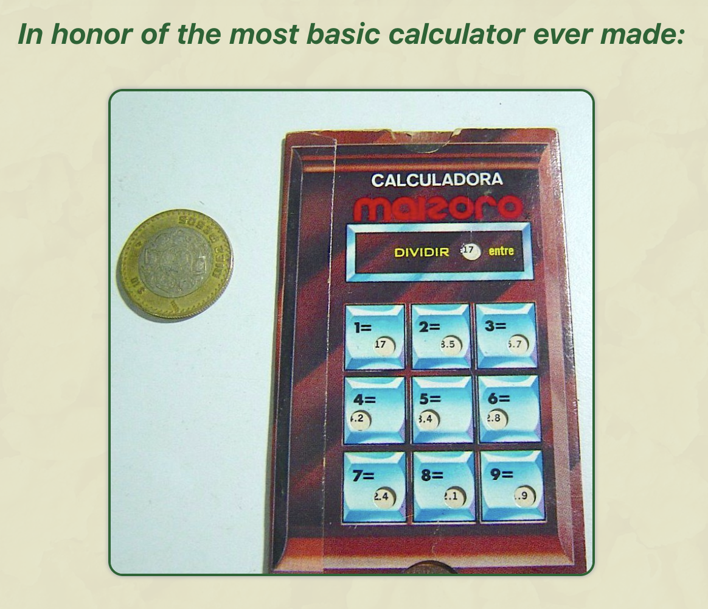
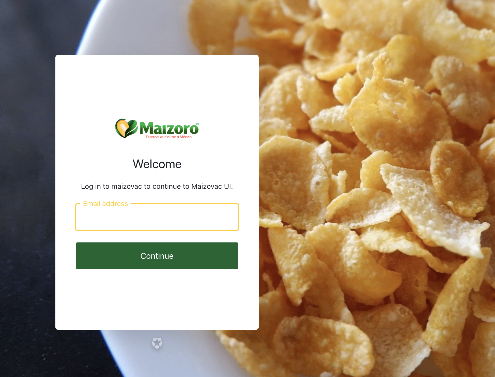
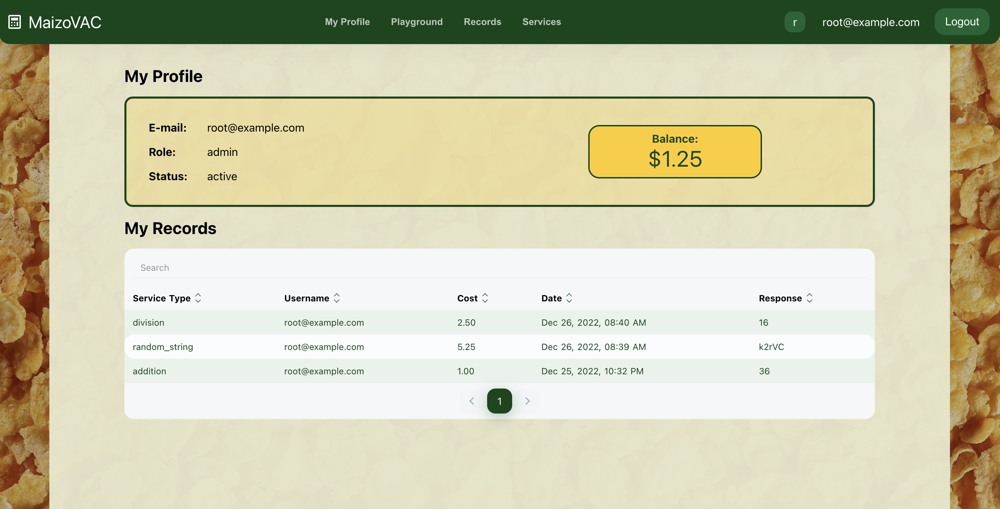
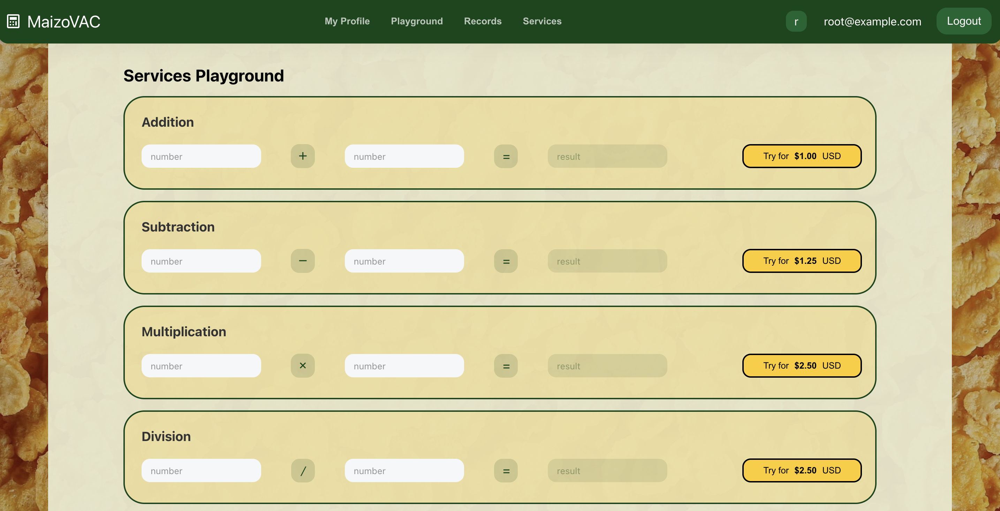
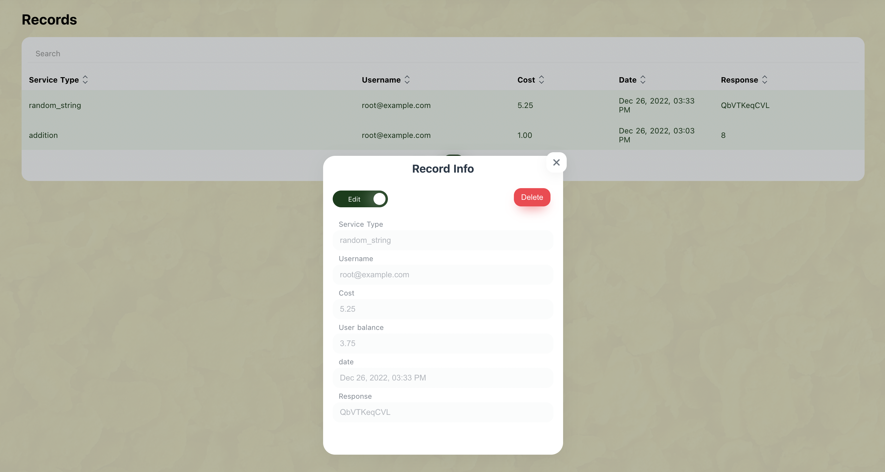

# MaizovacUI

Service calculator client with the 6 basic operations provided in a [REST API].



## Features

- Authentication with Auth0 and JWT
- Services:
    - addition
    - subtraction
    - multipication
    - division
    - square root
    - random string (external provider)
- Keep track of all the service executions made by the user
- Allow changing the status of the services
- Displays a table with all the transactions made by the users

### Assumptions
- Balance/Credit starts in $10 and decreases as the User requests for a service
- Records can be deleted so that the user balance can be restored
- Services are not removable, they can only be edited and disabled

## Stack
- [Nuxt JS](https://nuxtjs.org/)
    A Vue framerok that includes routing, bundler and typescript support
- [Auth0](https://auth0.com/)
    A third party framework to handle user authentication and RBAC
- [Vuesax](https://vuesax.com/)
    A small components library for Vue
- [nuxt/auth](https://auth.nuxtjs.org/)
    A NuxtJS plugin that provides JWT integration with Auth0 service

## Build Setup

**Step 1:** Set env variables

```bash
export BASE_URL=http://137.184.83.189:3000
export AUTHORIZATION_DOMAIN=maizovac.us.auth0.com 
export AUTHORIZATION_CLIENT_ID=V6iNlPmgUv84bhbHFjSoOeuGxmbdgGXo
export AUTHORIZATION_AUDIENCE=maizovac-api
```


`BASE_URL` is the URL of the API

`AUTHORIZATION_DOMAIN`, `AUTHORIZATION_CLIENT_ID` and  `AUTHORIZATION_AUDIENCE` all are needed as part of the Auth0 service, follow [this](https://auth.nuxtjs.org/providers/auth0) instructions on how to obtain those values. An Auth0 account will be needed.

**Step 2:** Run the server

```bash
# install dependencies
$ npm install

# serve with hot reload at localhost:8000
$ npm run dev

# or build for production and launch server
$ npm run build
$ npm run start

# or generate static project
$ npm run generate
```

For detailed explanation on how things work, check out [Nuxt.js docs](https://nuxtjs.org).


## Screenshots

- Integrated authentication service:



- Personal balance and records tracking:



- Services playground:



- Records deletion support:

